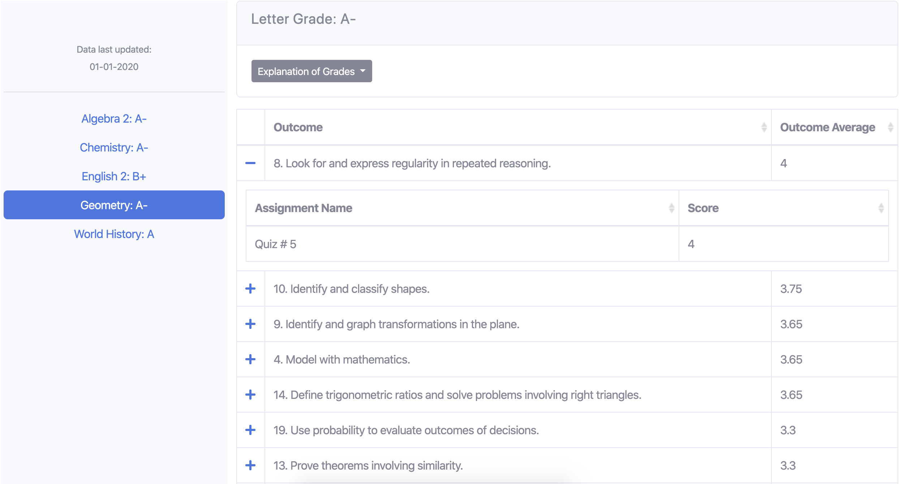

[](https://ucf-open-slackin.herokuapp.com/)

# Custom Grade Dashboard for Canvas

Built for displaying Canvas Learning Outcome results and aggregating them into a letter grade. This includes views for students, parents, teachers and advisers.

### Screenshots



## Setup

### Virtual Environment

Create a virtual environment that uses Python 3:

```
virtualenv venv -p /usr/bin/python3
source venv/bin/activate
```

Install the dependencies from the requirements file.

```
pip install -r requirements.txt
```

### Create your local settings file

Create settings.py from settings.py.template

```
cp settings.py.template settings.py
```

Note: settings.py is already referenced in the .gitignore and multiple python files, if you want a different settings file name be sure to update the references.

#### Add your values to the settings file.

At a minimum, CONSUMER_KEY, SHARED_SECRET, and secret_key need to be input by the developer. The secret_key is used by Flask, but the CONSUMER_KEY and SHARED_SECRET will be used in setting up the LTI. For security purposes, it's best to have randomized keys. You can generate random keys in the command line by using os.urandom(24) and inputing the resulting values into the settings.py file:

```
import os
os.urandom(24)
```

### Run a Development Server

Here's how you run the flask app from the terminal:

```
export FLASK_APP=app.app
flask run
```

### Open in a Browser

Your running server will be visible at [http://127.0.0.1:5000](http://127.0.0.1:5000)

## Install LTI in Canvas

- Have the XML, consumer key, and secret ready.
  - You can use the [XML Config Builder](https://www.edu-apps.org/build_xml.html) to build XML.
- Navigate to the course that you would like the LTI to be added to. Click Settings in the course navigation bar. Then, select the Apps tab. Near the tabs on the right side, click 'View App Configurations'. It should lead to a page that lists what LTIs are inside the course. Click the button near the tabs that reads '+ App'.
- A modal should come up that allows you to customize how the app gets added. Change the configuration in the Configuration Type dropdown menu to 'By URL' or 'Paste XML' depending on how you have your LTI configured. If your LTI is publicly accessible, 'By URL' is recommended. From there, fill out the Name and Consumer Keys, and the Config URL or XML Configuration. Click Submit.
- Your LTI will appear depending on specifications in the XML. Currently, they get specified in the **options** tag within the **extensions** tag. Extensions can include these options:
  - Editor Button (visible from within any wiki page editor in Canvas)
  - Homework Submission (when a student is submitting content for an assignment)
  - Course Navigation (link on the lefthand nav)
  - Account Navigation (account-level navigation)
  - User Navigation (user profile)

**Note**: If you're using Canvas, your version might be finicky about SSL certificates. Keep HTTP/HTTPS in mind when creating your XML and while developing your project. Some browsers will disable non-SSL LTI content until you enable it through clicking a shield in the browser bar or something similar.

## Notes on general architecture

### Data

Grade, user and course data are pulled nightly through a cron job (APScheduler in the _cron.py_ file) and stored in a Postgres Database.

- Updates Enrollments Terms
- Updates all the users in the account
- Updates Courses for the current term
- Updates courses users (i.e. students)
- Pulls all outcome results for every course and updates them in the database
- Calculates grades based on Design Tech High School's grading algorithm (grade algorithm can be updated in the the grade_calculation table)

The _utilities_ folder holds the logic for the data pull including Canvas and database related logic.

## Setup db

Uses [Flask-Migrate](https://flask-migrate.readthedocs.io/en/latest/)

```
flask db init
flask db migrate -m "Initial migration"
flask db upgrade
```

## Environmental Variables

Various environmental variables are required to handle development vs production environemnts, api tokens, and other sensitive information.

### For Canvas

- CONSUMER_KEY
- SHARED_SECRET
- CANVAS_API_KEY
- CANVAS_API_URL

### Config

- CONFIG _(for the flask app)_
- PULL_CONFIG _for the data_pull and cron job_

### Flask Env

- FLASK_ENV
- FLASK_APP

### For Databases

- DEVELOPMENT_DB_URI (_local_)
- HEROKU_POSTGRESQL_OLIVE_URL (_or whatever your heroku db might be_)

## Built with

- [Flask](http://flask.palletsprojects.com/en/1.1.x/) - the web framework used
- [Postgres](https://www.postgresql.org/) - DBMS
- [Heroku](https://www.heroku.com/) - Hosting

### Flask Extensions

- Flask-SQLAlchemy
- Flask-Marshmallow
- Flask-Migrate
- Flask-Admin

## Acknowledgments

- [University of Central Florida - Open Source
  ](https://github.com/ucfopen)
